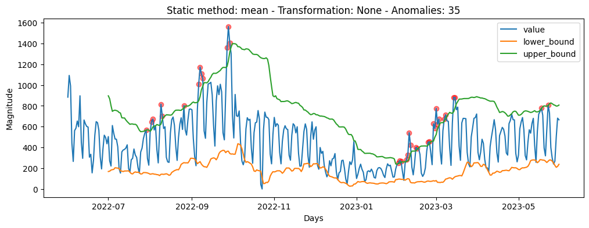

# Anomaly Detection in Univariate Time Series Incorporating Time Series

## Introduction

The approaches discussed in this section and the one being presented are inspired by the research paper titled "Anomaly Detection in Univariate Time Series Incorporating Active Learning". Our solution differs from the referenced approach in that we refrain from altering the average of predictions over time.

Since the mean is a statistical metric highly susceptible to outliers, it can significantly impact prediction intervals, leading to the detection or non-detection of alerts based on past outliers. In our initial attempt to address this issue, we explored using a more robust statistical metric, such as the median. However, this solution was implemented and found to have undesirable behavior, particularly in cases where numerous alerts were detected during stationary epochs, causing prediction intervals to stabilize. Our goal is to develop a solution that is sensitive to changes but prevents outliers from unduly influencing prediction intervals.

Anomalies are detected in time series, which is defined as $T$.

$$
T = \langle d_1 = (t_1, v_1), d_2 = (t_2, v_2), \ldots, d_m = (t_m, v_m) \rangle
$$

where:

- $d_i$ represents data point
- $t_i$ a timestamp
- $v_i$ an associated value, $v_i \in v_i \ in \ R^+$
- $m$ is the length of the time series

The algorithm $A$, detects anomalies given a time series $T$ with it sets of parameters $\lambda$,
defined as $A(T(\lambda))$, the output is a vector $z$ that indicates of data points are anomalies.

$\lambda$ contain (at least):

- $w = 30$, a sliding window
- $z-score$ = 1.625, assuming a normal distribution it is similar to a percentile of $\approx5\%$.

## Improvement: Square Root Transformation

Applying the square root transformation to a time series can have several potential benefits,
depending on the characteristics of the data and the goals of the analysis.

1) **Stabilizing Variances**: If the variance of the time series is not constant across time, it can be challenging to model and analyze. Taking the square root can be useful in stabilizing variances, making the data more homoscedastic (having constant variance).

2) **Reducing Sensitivity to Extreme Values**: The square root transformation can reduce the impact of extreme values (outliers) in the data. This can be beneficial when outliers have a disproportionate effect on the analysis.

We define the algorithm $B$ as $B(F(T(\lambda)))$, i.e. $(B ∘ F ∘ T) \ \lambda$

where:

- $F$ = $\sqrt{v_i}$

Here we provide a result comparasion between the algorithm $A$ and $B$ on the dataset [Argentina Education](../data/Education_Argentina.csv).
We can notice that the upper bound limiter is more smother and the jumps of the window prediction are reduced.

## Possible issues

This alternative looks promising, but the challenge lies in how we can present this information to the user. The transformed values can be returned to
their original values by applying the inverse transformation, i.e., $F^{-1}$. However, the immediate transformation of the lower bound and the upper bound is not straightforward,
as the computation of these values involves the standard deviation, which is not a linear function. Additionally, the computation of the mean is done over transformed values.
